<h1 align="center">
  BLINKWOOD TECH
   
  
</h1>

<h3 align="center">
  Pioneering Technology Solutions for Private & Government Sectors
</h3>

  
  
  

<!-- Overview Section -->

  
  
  **Delivering Advanced End-to-End Data, Cybersecurity, and Cloud Solutions**
  
  Blinkwood Tech specializes in business intelligence/data analysis, cybersecurity, and cloud infrastructure solutions for private enterprises and government agencies. We optimize operations through industry-standard technologies and compliance-driven solutions.

## 🔐 Government Credentials & Certifications
<table>
  <tr>
    <td width="50%">
      <h4>Official Registrations</h4>
      <ul>
        <li>SAM.gov registered</li>
        <li>USFCR certified</li>
        <li>WOSB certified</li>
        <li>Pursuing SBA 8(a) Certification</li>
      </ul>
    </td>
    <td width="50%">
      <h4>Technical Certifications</h4>
      <ul>
        <li>Certified Data Management Professional (CDMP)</li>
        <li>AWS Certified Solutions Architect</li>
        <li>Tableau & Power BI certified</li>
        <li>Google Professional Data Engineer</li>
        <li>Microsoft Certified</li>
        <li>Certified Analytics Professional (CAP)</li>
      </ul>
    </td>
  </tr>
</table>

## 🛠️ Core Service Offerings

### 📊 Comprehensive Data Solutions
<table>
  <tr>
    <td width="33%">
      <h4>Data Management & Analytics</h4>
      
Advanced analytics, AI, and machine learning for deep insights

    </td>
    <td width="33%">
      <h4>Cloud Solutions</h4>
      
Tailored infrastructure for secure data management

    </td>
    <td width="33%">
      <h4>Automation & Integration</h4>
      
ETL automation and data source integration

    </td>
  </tr>
</table>

### 🔒 Cybersecurity Expertise

  
  
  

<ul>
  <li>Cloud security and penetration testing</li>
  <li>FISMA, NIST, HIPAA, GDPR, and SOX compliance</li>
  <li>24/7 managed security services</li>
  <li>Security assessment & authorization (A&A)</li>
</ul>

## ☁️ Cloud & Platform Expertise
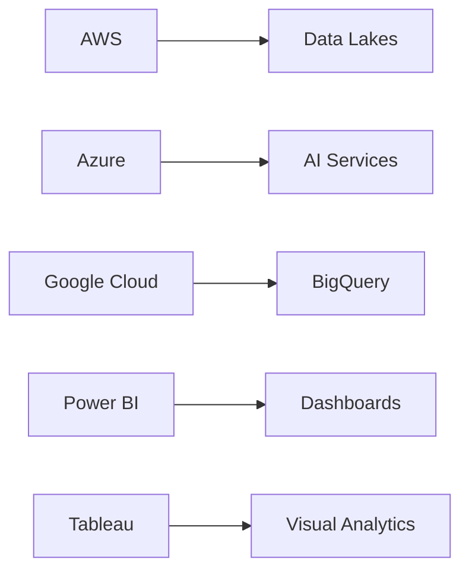
## 🏛️ Government & Industry Experience

### Previous Clientele
<table>
  <tr>
    <td width="25%">
      <h4>Government</h4>
      
Federal, state, and local agencies

    </td>
    <td width="25%">
      <h4>Financial</h4>
      
Banks and financial institutions

    </td>
    <td width="25%">
      <h4>Healthcare</h4>
      
Providers and insurers

    </td>
    <td width="25%">
      <h4>Retail</h4>
      
E-commerce platforms

    </td>
  </tr>
</table>

## 📞 Contact Blinkwood Tech

  
  
  

## 🏆 Project Showcase

<table>
  <!-- Row 1 -->
  <tr>
    <td width="50%">
      <h4>Predictive Reporting System</h4>
      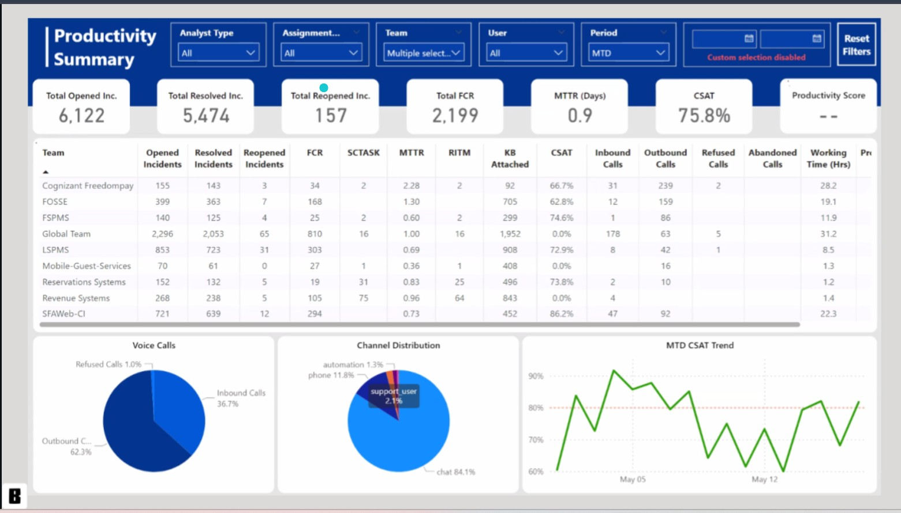
      
Advanced forecasting dashboard enabling 95% accurate inventory predictions for retail chains

    </td>
    <td width="50%">
      <h4>Order Tracking Dashboard</h4>
      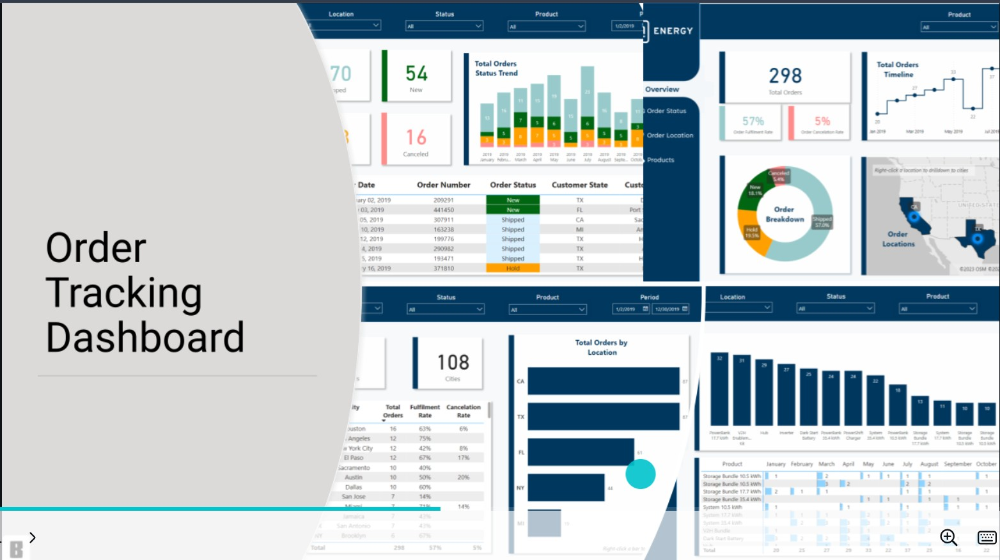
      
Real-time logistics monitoring system reducing delivery inquiries by 40% for e-commerce platforms

    </td>
  </tr>

  <!-- Row 2 -->
  <tr>
    <td width="50%">
      <h4>Customer Experience Analytics</h4>
      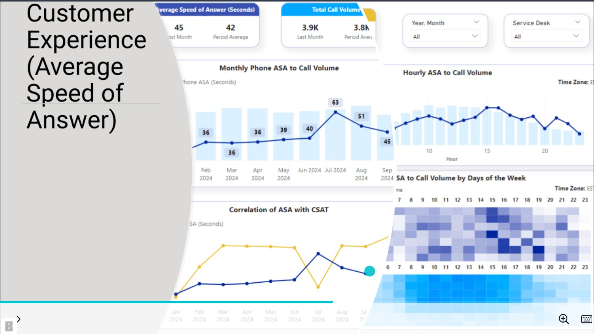
      
Sentiment analysis platform correlating support interactions with NPS scores (+22% improvement)

    </td>
    <td width="50%">
      <h4>HR Performance Dashboard</h4>
      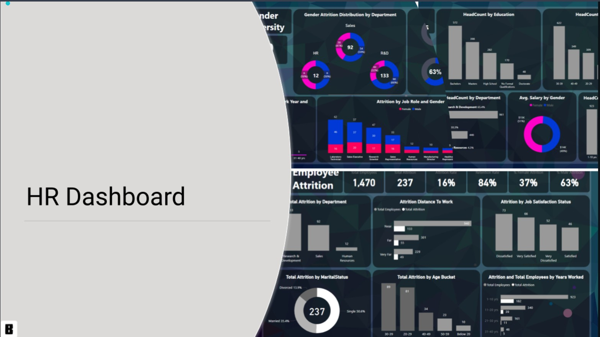
      
Workforce analytics solution reducing attrition risk by identifying retention patterns

    </td>
  </tr>

  <!-- Row 3 -->
  <tr>
    <td width="50%">
      <h4>Sales Performance Dashboard</h4>
      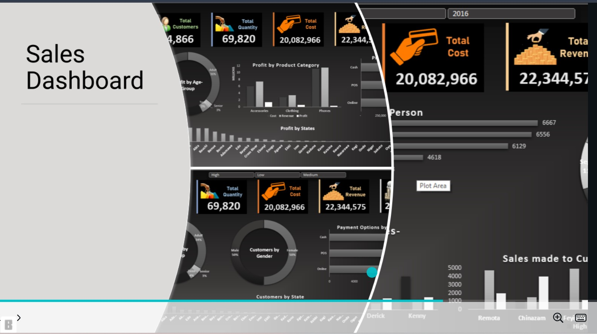
      
Regional sales tracking system identifying $2.3M in untapped market opportunities

    </td>
    <td width="50%">
      <h4>Udemy Course Analysis</h4>
      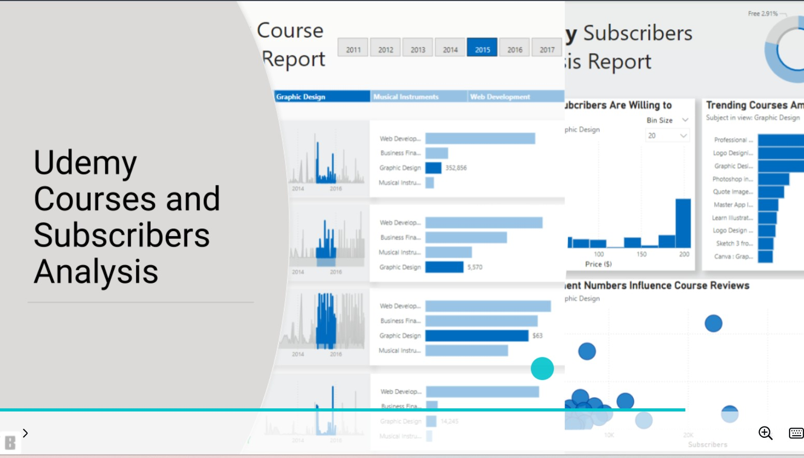
      
Subscription pattern analysis driving 35% better course recommendations for online learners

    </td>
  </tr>

  <!-- Row 4 -->
  <tr>
    <td width="50%">
      <h4>Spotify Top Song Analysis</h4>
      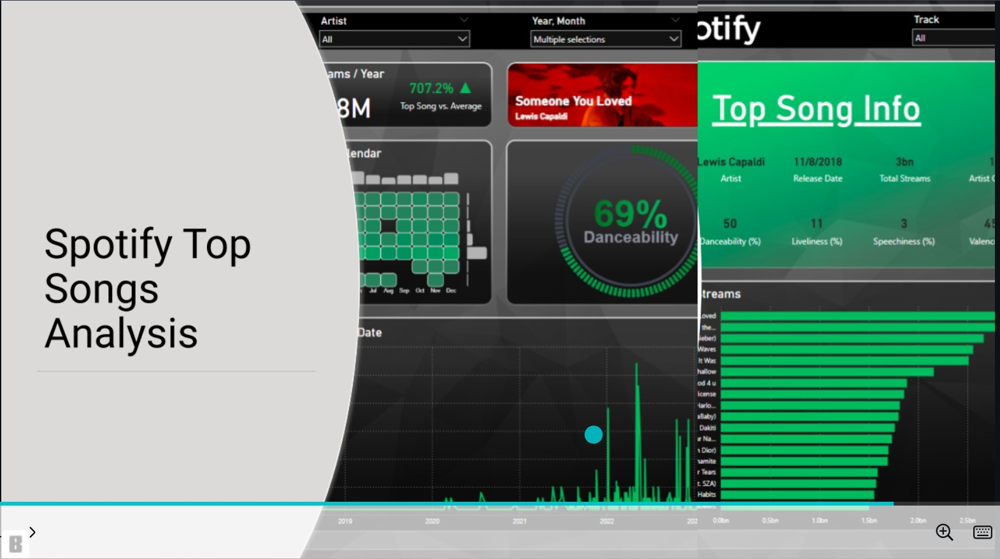
      
Trend forecasting model predicting viral hits with 82% accuracy for music labels

    </td>
    <td width="50%">
      <h4>Fraud Detection Dashboard</h4>
      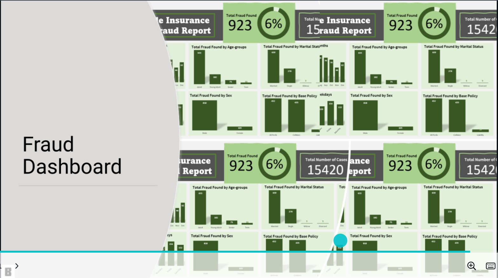
      
Anomaly detection system preventing $1.4M monthly in fraudulent transactions

    </td>
  </tr>

  <!-- Row 5 -->
  <tr>
    <td width="50%">
      <h4>Credit Card Finance Dashboard</h4>
      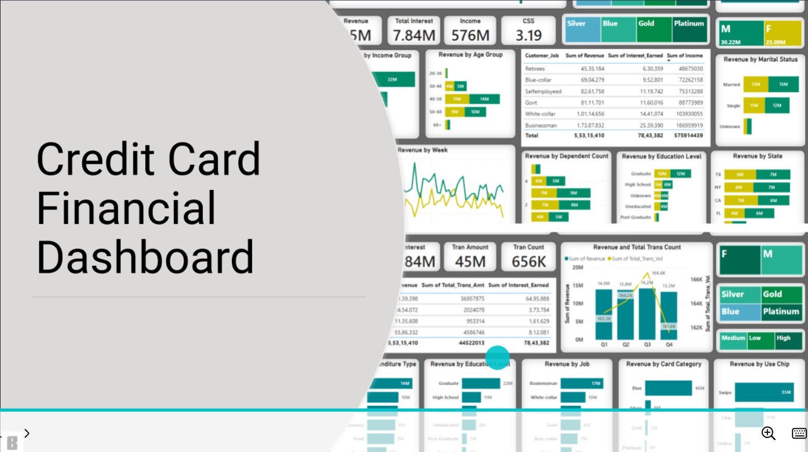
      
Spending pattern visualization reducing default risk by 28% for financial institutions

    </td>
    <td width="50%">
      <h4>Student Performance Tracker</h4>
      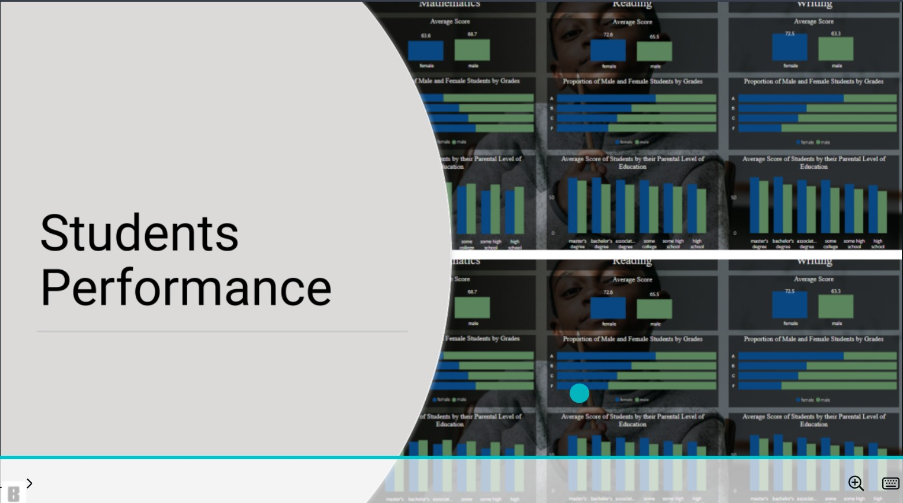
      
Learning outcome predictor helping institutions identify at-risk students 6 weeks earlier

    </td>
  </tr>
</table>

  
  &#8287;&#8287;
  

